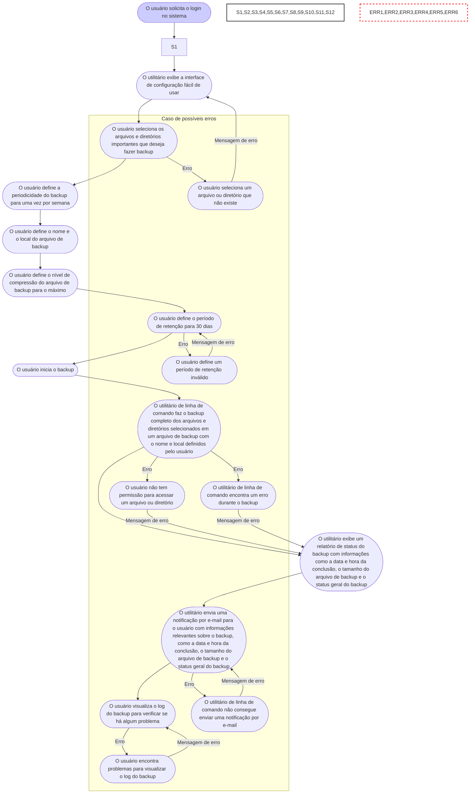
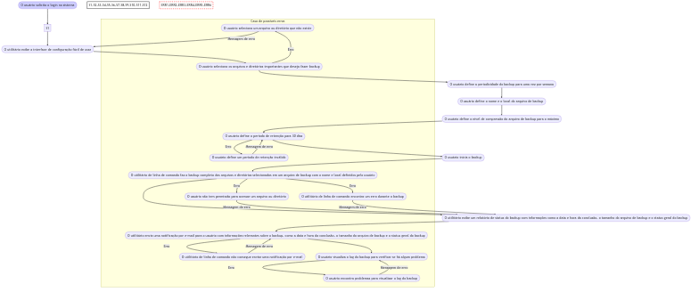

# Diagrama de Caso de Uso

__Cenário de caso de uso principal__:
O usuário deseja fazer um backup completo de todos os seus arquivos e diretórios importantes em um determinado local com nível de compressão máximo e com um período de retenção de 30 dias.

__Tigger Event__:  o usuário iniciando manualmente o backup.

__Caso de Sucesso__: 

- O usuário abre o utilitário de linha de comando para backups.
- O utilitário exibe a interface de configuração fácil de usar que permite ao usuário definir os diretórios e arquivos a serem incluídos no backup, a periodicidade do backup, o nível de compressão, o período de retenção e outras opções relevantes.
- O usuário seleciona os arquivos e diretórios importantes que deseja fazer backup.
- O usuário define a periodicidade do backup para uma vez por semana.
- O usuário define o nome e o local do arquivo de backup.
- O usuário define o nível de compressão do arquivo de backup para o máximo.
- O usuário define o período de retenção para 30 dias.
- O usuário inicia o backup.
- O utilitário de linha de comando faz o backup completo dos arquivos e diretórios selecionados em um arquivo de backup com o nome e local definidos pelo usuário.
- O utilitário exibe um relatório de status do backup com informações como a data e hora da conclusão, o tamanho do arquivo de backup e o status geral do backup.
- O utilitário envia uma notificação por e-mail para o usuário com informações relevantes sobre o backup, como a data e hora da conclusão, o tamanho do arquivo de backup e o status geral do backup.
- O usuário visualiza o log do backup para verificar se há algum problema.

__Casos de possíveis erros__:

- O usuário seleciona um arquivo ou diretório que não existe, o utilitário de linha de comando exibe uma mensagem de erro indicando que o arquivo ou diretório não existe.
- O usuário define um período de retenção inválido, o utilitário de linha de comando exibe uma mensagem de erro indicando que o período de retenção é inválido.
- O usuário não tem permissão para acessar um arquivo ou diretório, o utilitário de linha de comando exibe uma mensagem de erro indicando que o usuário não tem permissão para acessar o arquivo ou diretório.
- O utilitário de linha de comando encontra um erro durante o backup, o utilitário exibe uma mensagem de erro indicando o erro encontrado e interrompe o backup.
- O utilitário de linha de comando não consegue enviar uma notificação por e-mail, o utilitário exibe uma mensagem de erro indicando que a notificação por e-mail falhou.
- O usuário encontra problemas para visualizar o log do backup, o utilitário exibe uma mensagem de erro indicando que houve um problema ao acessar o arquivo de log.

