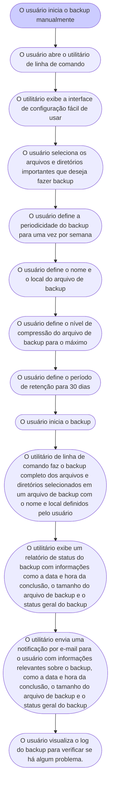
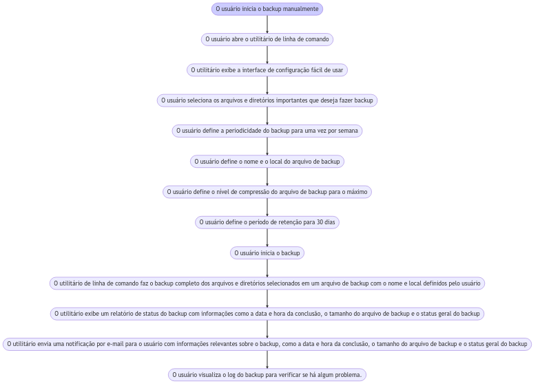

## Diagrama:

```mermaid
flowchart TD;
%% Trigger event
TRIGGER([O usuário inicia o backup manualmente])-->S1;
style TRIGGER fill:#ccf

%% Main flow
S1([O usuário abre o utilitário de linha de comando])-->S2([O utilitário exibe a interface de configuração fácil de usar]);
S2-->S3([O usuário seleciona os arquivos e diretórios importantes que deseja fazer backup]);
S3-->S4([O usuário define a periodicidade do backup para uma vez por semana]);
S4-->S5([O usuário define o nome e o local do arquivo de backup]);
S5-->S6([O usuário define o nível de compressão do arquivo de backup para o máximo]);
S6-->S7([O usuário define o período de retenção para 30 dias]);
S7-->S8([O usuário inicia o backup]);
S8-->S9([O utilitário de linha de comando faz o backup completo dos arquivos e diretórios selecionados em um arquivo de backup com o nome e local definidos pelo usuário]);
S9-->S10([O utilitário exibe um relatório de status do backup com informações como a data e hora da conclusão, o tamanho do arquivo de backup e o status geral do backup]);
S10-->S11([O utilitário envia uma notificação por e-mail para o usuário com informações relevantes sobre o backup, como a data e hora da conclusão, o tamanho do arquivo de backup e o status geral do backup]);
S11-->S12([O usuário visualiza o log do backup para verificar se há algum problema.]);
```

