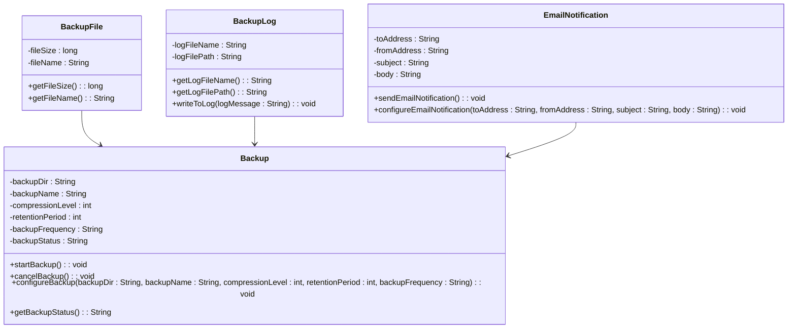

# Diagrama de Classes

Este diagrama de classes apresenta quatro classes principais do nosso projeto:

A classe Backup representa a funcionalidade de backup em si e contém os atributos necessários para configurar e realizar o backup, além dos métodos para iniciar e cancelar o backup e obter informações sobre o status do backup.

A classe BackupFile representa um arquivo de backup individual, e contém os atributos necessários para representar o tamanho e o nome do arquivo de backup.

A classe BackupLog representa o arquivo de log do backup, e contém os atributos necessários para representar o nome e o caminho do arquivo de log, bem como um método para gravar mensagens de log.

A classe EmailNotification representa a funcionalidade de envio de notificações por e-mail, e contém os atributos necessários para configurar e enviar as notificações por e-mail.

Além disso, o diagrama de classes mostra que cada classe BackupFile, BackupLog e EmailNotification está associada à classe Backup, representando a relação entre essas classes.

