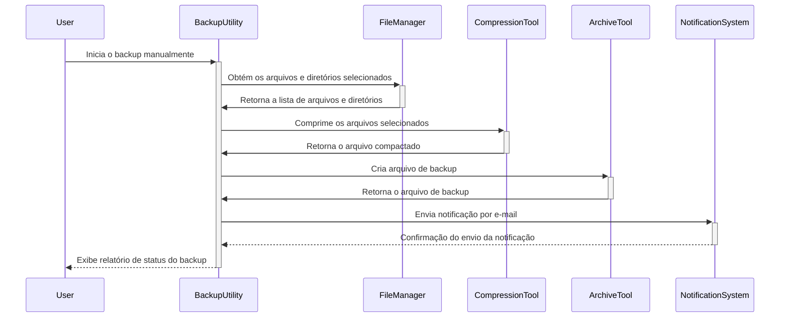
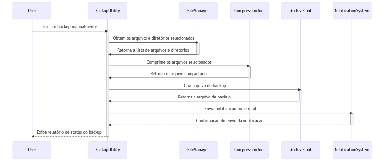

# Diagrama de Sequencia

Neste diagrama, o usuário inicia manualmente o backup, o BackupUtility obtém a lista de arquivos e diretórios selecionados com a ajuda do FileManager, comprime os arquivos com o CompressionTool, cria o arquivo de backup com o ArchiveTool e envia uma notificação por e-mail com o NotificationSystem. O BackupUtility exibe um relatório de status do backup para o usuário após a conclusão.

